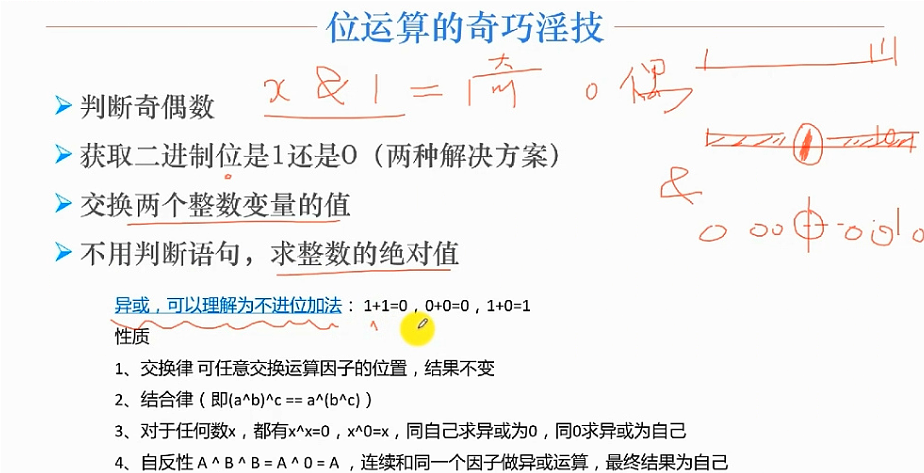
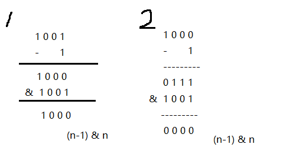
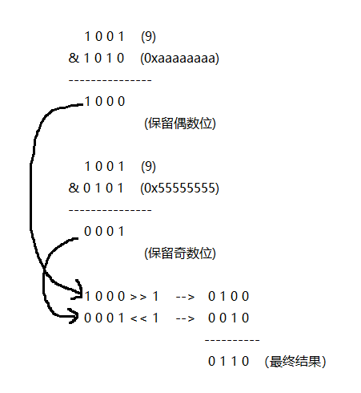

### 位运算



### 题1：找出唯一成对的数


解题思路：

n^1^1 = n, 一个数两次^同一个数，得到数本身。

n^0 = n, 任何数异或0都是他自己。

将res^数组下标^数组的value，最终得出的结果就为重复值。

```python
def find_repeat(nums):
	res = 0
	for i in range(len(nums)):
		res ^= i
		res ^= nums[i]
	return res


print(find_repeat([1, 2, 3, 3, 4, 5, 6]))
```

### 题2：二进制中1的个数


解题思路：


#### 解法一

将9的二进制数的每一位与1做与运算，如果结果为1移到该位的值，则该位数字为1，否则为0。

需循环32次，将1依次移到指定位数与9的二进制数做与运算，如果结果为1移到该位的值则计数。

注：32次，整数为四字节表示，一字节八位。

```python
def count_bin_1(n):
	count = 0
	for i in range(32):
		if (1 << i) & n == 1 << i: count += 1
	return count


print(count_bin_1(9))
```

#### 解法二



查看上图总结规律，(n-1)&n实际上就是消除1001中“1”的过程，统计执行了多少次(n-1)&n，即可知道1001中包含几个“1”

```python
def count_bin_1(n):
	count = 0
	while n != 0:
		n = (n - 1) & n
		count += 1
	return count


print(count_bin_1(15))
```

### 题3：是否为2的整数次方


解题思路:

2的整数次方，2^0, 2^1, 2^2, 也就是说，将该数转化为2进制表示，只有一个1出现。

```python
def is2(n):
	return not (n-1)&n


print(is2(8))
```

### 题4：将二进制整数的奇偶位互换

解题过程



```python
def exchange(n):
	ji = n & 0xaaaaaaaa  # 10101010 10101010 10101010 10101010
	ou = n & 0x55555555  # 01010101 01010101 01010101 01010101
	return (ji >> 1) ^ (ou << 1)


print(exchange(9))
```


### 总结

1. 异或运算相当于不进位的加法运算，1+1为0，0+0为0，1+0为1，所以异或相同为0，不同为1

2. n^0 = n;  n^x^x = n; x^x = 0

3. (n-1) & n 从低位依次往高位消除n(二进制表示)中的1。

4. n&0xaaaaaaaa 只保留2进制偶数位；0xaaaaaaaa == 0b10101010 10101010 10101010 10101010

   n&0x55555555 只保留2进制奇数位;  0x55555555 == 0b01010101 01010101 01010101 01010101

